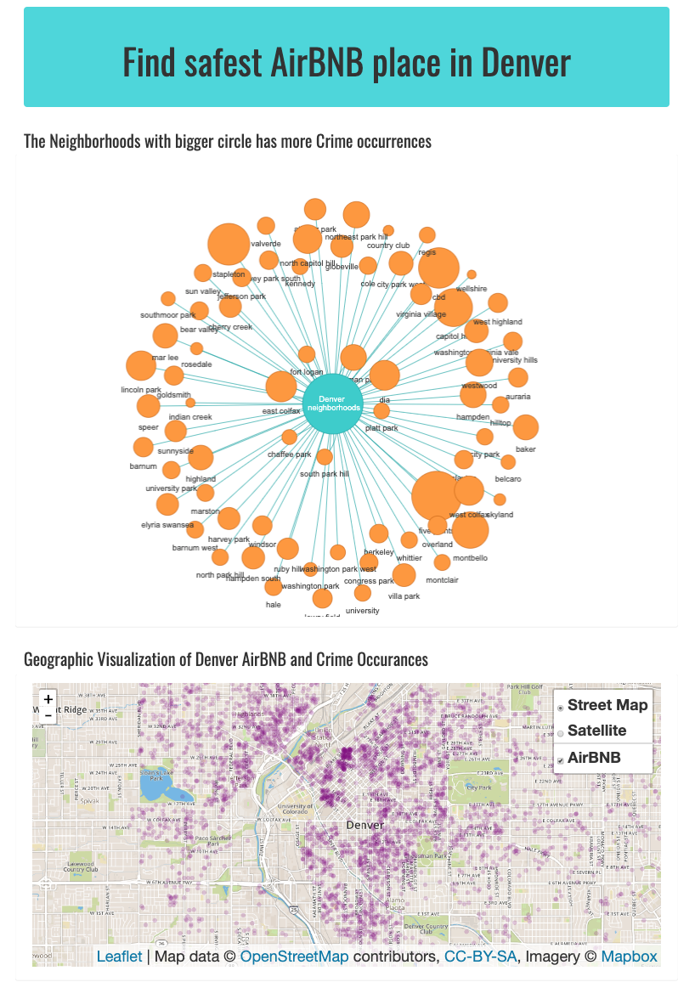
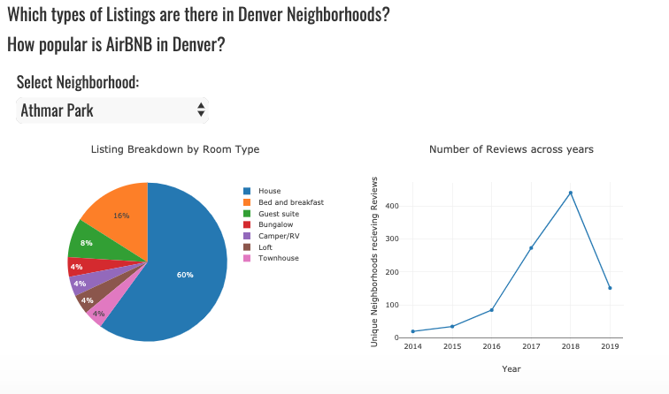

# Find safest AirBNB place in Denver

This goal of this project was to create a JavaScript based dashboard on Denver AirBNB and Crime accurances on 2019, The data is based on the National Incident Based Reporting System (NIBRS) which includes all victims of person crimes and all crimes within an incident.

Web application is deployed at the following link: 
https://denver-airbnb-crime-2019.herokuapp.com/

#### Project Team:
* Lauren Hilinski
* Abigail Metzger
* Mona Arami
* Brennan Stottlemyer

#### Technology stack used in developing this web application is as follows:

* Back End: 
  * Flask
  * sqlite
  * SQLAlchemy ORM
  * Pandas
  * Python 3.6

* Front End: 
  * HTML/CSS/Bootstrap
  * Javascript
  * JS libraries used for plotting: D3.js, Plotly.js, Leaflet.js, ?

#### Images from the final project

#### References :
[AirBNB References](http://insideairbnb.com/get-the-data.html)

[Crime References](https://www.denvergov.org/opendata/dataset/city-and-county-of-denver-crime)

